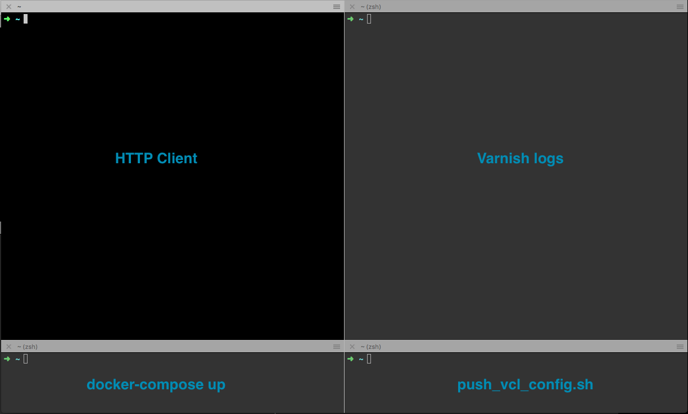

# Varnish Workshop

## Description

Welcome to the varnish workshop, the purpose of this workshop is to introduce people to varnish configuration language or VCL.

This workshop is built using two components:
- docker container with varnish (6.0 by default)
- docker container with a server that responds with your request information (echo) ([https://github.com/mendhak/docker-http-https-echo](https://github.com/mendhak/docker-http-https-echo))

## Getting started

1) Install docker and docker-compose (https://docs.docker.com/compose/install/)
2) Clone this repository and run docker-compose:

```
git clone <repo name here>
cd varnish-workshop/docker
docker-compose build
docker-compose up
```
3) Validate you see this output
```
➜  docker docker-compose up
Creating network "docker_default" with the default driver
Creating docker_http-backend_1 ...
Creating docker_varnish_1 ...
Creating docker_http-backend_1
Creating docker_varnish_1 ... done
Attaching to docker_http-backend_1, docker_varnish_1
varnish_1       | Debug: Version: varnish-6.0.1 revision 8d54bec5330c29304979ebf2c425ae14ab80493c
varnish_1       | Debug: Platform: Linux,4.9.49-moby,x86_64,-junix,-smalloc,-sdefault,-hcritbit
varnish_1       | Debug: Child (19) Started
varnish_1       | Info: Child (19) said Child starts
```

## Playing with VCL in this workshop

To edit the VCL using your favorite IDE the following directory ```varnish-workshop/docker/varnish/user_configs```  is mounted on your host.

Simply edit this file ```varnish-workshop/docker/varnish/user_configs/user.vcl``` in your IDE.

Then load and activate the new configuration like so:
```./varnish/scripts/push_vcl_config.sh <new_config_name>```

To view which configuration version is active you can use the following command:
 ```
docker exec -it docker_varnish_1 varnishadm -T 127.0.0.1:6082 -S /etc/varnish/secret vcl.list

available   warm/warm          0 boot
active      warm/warm          0 task1

```

## Looking at the varnish log during this workshop

Varnish logs are accessed using a dedicated program called varnishlog
You can use the following command to see logs in realtime when you make requests
```
docker exec -it docker_varnish_1 varnishlog -g request
```

## Varnish documentation:

  You can refer to the following varnish documentation:

- [User guide](https://varnish-cache.org/docs/trunk/users-guide/)
- [VCL Basics](https://book.varnish-software.com/4.0/chapters/VCL_Basics.html)
- [Default VCL](https://github.com/varnishcache/varnish-cache/blob/master/bin/varnishd/builtin.vcl)


## Workshop Tasks:


### Task 1 - Setup the environment and validate its functional

1. Complete the getting started section
2. Read how to modify VCL configuration and how to look at logs
3. Test your workshop setup
```
curl -I http://127.0.0.1:8080
```
4. Recommendation: split your terminal into 4 parts like so:

  
### Task 2 - Bypass cache if URL contains '/api' or HTTP request contains header 'Foo: bar' 

Conditions:

- request header Foo contains value bar
OR
- request URL contains /api/

Desired behavior:
- Bypass cache (using [vcl_pipe](https://book.varnish-software.com/4.0/chapters/VCL_Basics.html#varnish-finite-state-machine))

Subroutine: [vcl_recv](https://book.varnish-software.com/4.0/chapters/VCL_Basics.html#built-in-vcl-recv)

VCL Code:
```
sub vcl_recv {

    if (req.http.Foo == "bar" || req.url ~ "/api/") {
        return(pipe);
    }
    
}
```

Explanation:
- [Different variables can be accessed in different subroutines](https://book.varnish-software.com/4.0/chapters/VCL_Basics.html#variables-in-vcl-subroutines) 
- vcl_recv happens when an inbound HTTP request arrives from the client
- Here we accessed ```req.http``` (HTTP request header) and ```req.url``` (HTTP request URL)
- ```return(pipe)``` bypasses the regular cache lookup and sends the request directly to the backend
- Headers are not case sensitive by default

Tests:
```
# responses for these requests shouldn't be cached
curl -vv http://127.0.0.1:8080/task2/api/
curl -vv http://127.0.0.1:8080/task2 -H 'foo: bar'

# responses for these requests should be cached
curl -vv http://127.0.0.1:8080/task2
```

 
### Task 3 - Configure a custom cache key

Desired behavior:
- request header X-Forwarded-Proto value should evaluated as part of the cache key

Subroutine: [vcl_hash](https://varnish-cache.org/docs/trunk/users-guide/vcl-hashing.html)

VCL Code:
```
sub vcl_hash {
    hash_data(req.http.X-Forwarded-Proto);
}
```

Explanation:

- The hash controls the cached object variance, in this case we want to keep a different copy of the objects for requests with different values of X-Forwarded-Proto request header

Tests:
```
# These requests should produce unique responses
curl -vv http://127.0.0.1:8080/task3 -H 'X-Forwarded-Proto: https'
curl -vv http://127.0.0.1:8080/task3 -H 'X-Forwarded-Proto: http'
curl -vv http://127.0.0.1:8080/task3
```

### Task 4 - Configure a custom TTLs

Desired behavior:
- response with content length greater than 1500 bytes should be cached for 24 hours
- response with content length smaller than 500 bytes shouldn't be cached
- all other responses should be cached for 1 minute

Subroutine: [vcl_backend_response](https://book.varnish-software.com/4.0/chapters/VCL_Basics.html#vcl-vcl-backend-response)

VCL Code:
```
import std;

sub vcl_backend_response {
	
	if (std.integer(beresp.http.content-length, 0) >= 1500) {
		set beresp.ttl = 24h;
	} elseif (std.integer(beresp.http.content-length, 0) < 500) {
		set beresp.uncacheable = true;
	} else {
		set beresp.ttl = 60s;
	}

}
```

Explanation:

- vcl_backend_response is triggered on backend HTTP response
- Notice the different prefix of ```beresp.http``` we used to access HTTP response headers
- Here we demonstrated using a VMOD (varnish module) called [std](https://varnish-cache.org/docs/trunk/reference/vmod_std.html#vmod-std-varnish-standard-module)
- We also demonstrated accessing and comparing header values in a basic control structure
- beresp.ttl is used to set TTL manually, (this overrides the default behavior of the TTL that is [documented here](https://book.varnish-software.com/4.0/chapters/VCL_Basics.html#the-initial-value-of-beresp-ttl))

Tests:

```
# This shouldn't be cached
curl -vv http://127.0.0.1:8080/task4/shortstory

# This should be cached for 1 minute
curl -vv http://127.0.0.1:8080/task4/mediumstory -H 'message: Lorem ipsum dolor sit amet, an etiam munere oblique has. Ei modo lucilius gloriatur vix, cu vix hinc voluptatum. Ne usu reque antiopam. Pri quaestio imperdiet mediocritatem no, ad fastidii intellegat nec. In vero debet viderer has, ex qui saperet mandamus Lorem ipsum dolor sit amet, an etiam munere oblique has. Ei modo lucilius gloriatur vix, cu vix hinc voluptatum. Lorem ipsum dolor sit amet, an etiam munere oblique has. Ei modo lucilius gloriatur vix, cu vix hinc voluptatum. Ne usu reque antiopam. Pri quaestio imperdiet mediocritatem no, ad fastidii intellegat nec. In vero debet viderer has, ex qui saperet mandamus Lorem ipsum dolor sit amet, an etiam munere oblique has. Ei modo lucilius gloriatur vix, cu vix hinc voluptatum'

# This should be cached for 24 hours
curl -vv http://127.0.0.1:8080/task4/longstory -H 'message: Lorem ipsum dolor sit amet, an etiam munere oblique has. Ei modo lucilius gloriatur vix, cu vix hinc voluptatum. Ne usu reque antiopam. Pri quaestio imperdiet mediocritatem no, ad fastidii intellegat nec. In vero debet viderer has, ex qui saperet mandamus Lorem ipsum dolor sit amet, an etiam munere oblique has. Ei modo lucilius gloriatur vix, cu vix hinc voluptatum. Ne usu reque antiopam. Pri quaestio imperdiet mediocritatem no, ad fastidii intellegat nec. In vero debet viderer has, ex qui saperet mandamus Lorem ipsum dolor sit amet, an etiam munere oblique has. Ei modo lucilius gloriatur vix, cu vix hinc voluptatum. Ne usu reque antiopam. Pri quaestio imperdiet mediocritatem no, ad fastidii intellegat nec. In vero debet viderer has, ex qui saperet mandamus Lorem ipsum dolor sit amet, an etiam munere oblique has. Ei modo lucilius gloriatur vix, cu vix hinc voluptatum. Ne usu reque antiopam. Pri quaestio imperdiet mediocritatem no, ad fastidii intellegat nec. In vero debet viderer has, ex qui saperet mandamus'
```

### Task 5 - Modify response headers on cache hit

Desired behavior:
- When an object is served from cache
	- remove HTTP header ```X-Powered-By```
	- add HTTP header ```Good: Day```

Subroutine: vcl_deliver

VCL Code:
```
sub vcl_deliver {
	
    if (obj.hits > 0) {
        unset resp.http.X-Powered-By;
        set resp.http.Good = "Day";
    }

}
```

Explanation:

- vcl_deliver is triggered before the response is sent back to the client
- We accessed ```obj``` which is the cached object and checked if hits counter is greater than 0
- We removed the response header using ```unset``` and added a new response header using ```set```

Tests:

```
# The first time you make this request it should contain X-Powered-By
# The second should contain Good: Day 
curl -vv http://127.0.0.1:8080/task5
```


## Cleanup

After you are done, cleanup your environment

```
cd varnish-workshop/docker
docker-compose down
```
